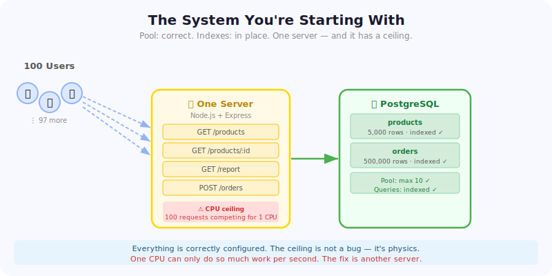
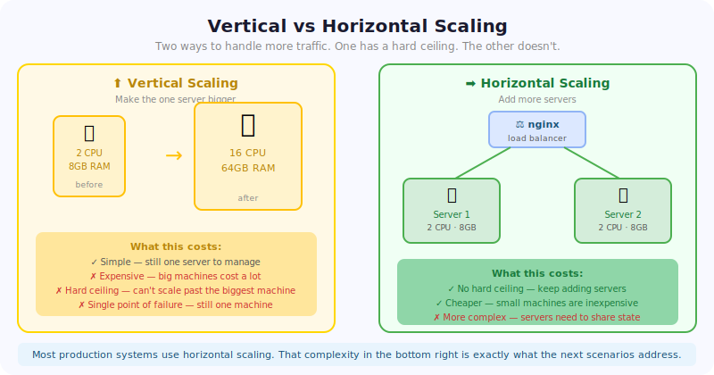
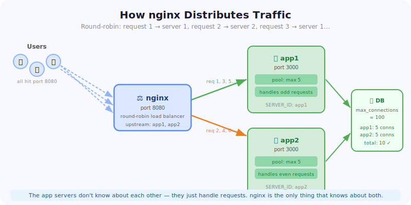
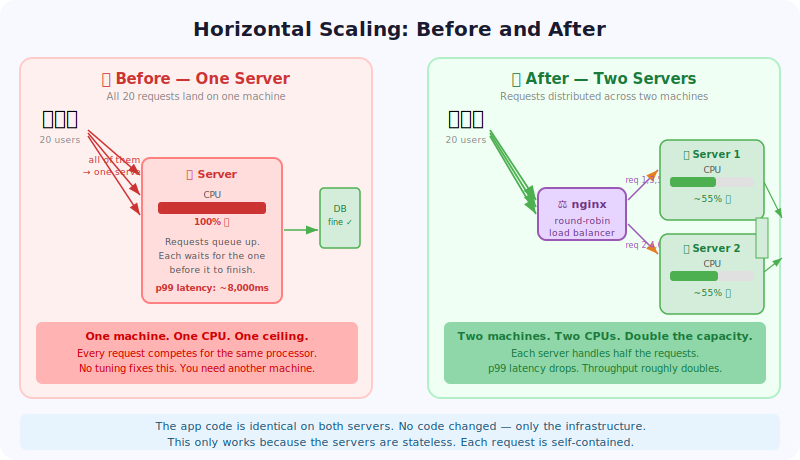

# Scenario 4: Horizontal Scaling

**Difficulty:** Entry Level  
**Concepts:** Horizontal Scaling, Load Balancing, Stateless Servers, Connection Budget
**Time:** ~45 minutes  
**Recommended:** Complete Scenarios 1–3 first, or read the recap below

---

## Quick Recap — Where You Are

In the first three scenarios you fixed real problems: a poorly configured single server (Scenario 1), learned to index slow queries (Scenario 2), and sized a connection pool correctly (Scenario 3). Each fix made the system itself meaningfully better.

The server you're working with today has none of those problems. The pool is correctly configured. The queries are indexed. The code is clean.

It still breaks under load — and no amount of tuning will fix it.

Some ceilings can't be optimized away. When you hit them, the only answer is more servers.

---

## The Situation

You're working on the backend for an e-commerce platform. It serves product listings, individual product pages, and a sales report used by the business team. Every request aggregates hundreds of thousands of rows — filtering by region, category, or date range.

Traffic has been growing steadily. The team has already been through the fixes from the previous scenarios: the pool is sized correctly, the queries are indexed, the code is clean. But the on-call engineer keeps seeing latency climb and requests per second plateau during peak hours no matter what gets adjusted.

Your tech lead sends you a message:

> _"We've tuned everything we can tune. The server is just hitting its ceiling can't keep up with this many requests at once. We need to scale horizontally — add a second server and put a load balancer in front. The code shouldn't need to change, just the infrastructure."_

Your job is to confirm the ceiling is real, understand what horizontal scaling means in practice, and make the change.



---

## Your Environment

| Service           | Where     | What it is                      |
| ----------------- | --------- | ------------------------------- |
| Catalog API       | Port 3000 | The app — one server to start   |
| Grafana Dashboard | Port 3002 | Live metrics                    |
| Prometheus        | Port 9090 | Metrics collection              |
| Nginx (after fix) | Port 8080 | Load balancer — you'll add this |

Open a terminal: **Ctrl+`**

Open Grafana: click the **Ports** tab, find Port 3002, click 🌐. Login: admin / admin. Navigate to Dashboards → Scenario 4 — Horizontal Scaling.

---

## Step 1 — Read the Code

Open `src/server.js`. Read the whole file. Look at what each endpoint does.

**Q1: Look at the pool configuration. How does it compare to the broken pool in Scenario 3? Is this pool the problem?**

```
Your answer:


```

**Q2: There are four routes: `/products`, `/products/:id`, `/report`, and `/orders`. Which one do you think will be the slowest under load and why?**

```
Your answer:


```

**Q3: The schema has indexes on `products.category`, `orders.product_id`, and `orders.created_at`. Look at the `/report` query — it joins products and orders and groups by category. Are the indexes helping this query? Are slow queries the problem?**

```
Your answer:


```

**Q4: If you doubled the pool size to `max: 20`, would that help? Why or why not?**

```
Your answer:


```

---

## Step 2 — Find the Ceiling

First, confirm the database is fully seeded. The seed inserts 500,000 orders — it takes about 30–60 seconds on first startup:

```bash
npm run status
```

You should see `Orders in DB: 500000`. If the number is 0 or missing, wait 30 seconds and run it again. The load test needs all 500k rows to show meaningful CPU load.

Open Grafana before you start. Watch the CPU Usage panel in particular.

Run the loadtest

```bash
npm run loadtest
```

This sends 100 concurrent users hitting all three main endpoints for 30 seconds.

Watch the **Request Rate** panel and the **p99 Latency** panel. You should see req/sec climb and then plateau — it hits a wall and stays there even though requests keep arriving.

Record what you see:

| Metric              | Value |
| ------------------- | ----- |
| Peak req/sec        |       |
| p99 latency at peak |       |
| Error rate          |       |

**Q5: The req/sec plateaus even with 100 concurrent users pushing traffic. The pool isn't exhausted — connections are available. Queries are fast. What is the actual bottleneck?**

```
Your answer:


```

> 💡 A single server has a fixed amount of CPU. When enough concurrent requests arrive, all doing real work simultaneously, they compete for that CPU. Adding more requests doesn't add more throughput — it just makes each request wait longer. This is the ceiling.

---

## Step 3 — Scale Horizontally

**Before you make any changes — consider your options:**

> **Option A — Vertical scaling.** Add more CPU to the existing server. Give the machine more cores. Bigger machine, same architecture. Simple, but expensive and has a hard ceiling — there's only so big a single machine can get.
>
> **Option B — Horizontal scaling.** Add a second app server. Run two copies of the app and put a load balancer in front to distribute requests between them. Traffic splits across both servers — each one handles half the load. Cheaper at scale, no hard ceiling — but introduces new complexity.
>
> **Option C — Optimize the queries further.** Make each request do less work so each request uses less CPU, raising the effective ceiling.

**Q6: Which option fixes the root cause? What does each one cost? What would change your answer if this was a sudden 10x traffic spike that lasts one hour?**

```
Your answer:


```

Option B is the fix. Option A (vertical scaling) works but has a hard limit — you can only make one machine so big, and big machines are expensive. Option C helps but doesn't solve the fundamental problem. Option B is the sustainable path: you can keep adding servers as traffic grows.

This is what **horizontal scaling** means — adding more machines rather than making one machine bigger.



### The Fix: Two Servers + Nginx

You're going to make two changes: edit `docker-compose.yml` to add a second app server and an nginx load balancer.

**What is nginx?** nginx (pronounced "engine-x") is a web server that can also act as a **load balancer**. It sits between the client and your servers and distributes incoming requests between them. Every request comes in to nginx on port 8080, and nginx forwards it to one of your app servers using round-robin (default) — first request goes to server 1, second to server 2, third to server 1, and so on.

The client never knows or cares which server handled their request. They send requests to port 8080 and nginx handles the rest.





#### Part 1: Add nginx config

Create `config/nginx.conf`. The `config/` directory already exists in the project — create the file inside it:

```bash
touch config/nginx.conf
```

Open it in the editor and paste in this content:

```nginx
events {
  worker_connections 1024;
}

http {
  upstream catalog_app {
    server app:3000;
    server app2:3000;
  }

  server {
    listen 80;

    location / {
      proxy_pass http://catalog_app;
      proxy_set_header Host $host;
      proxy_set_header X-Real-IP $remote_addr;
    }
  }
}
```

`upstream` defines the group of servers nginx will route between.
`proxy_pass` tells nginx to forward requests to that group.

#### Part 2: Update docker-compose.yml

Four changes to `docker-compose.yml` — update the `app` service (remove its port, add pool sizing), add `app2` as a second server, add `nginx` as the entry point, and update Prometheus to scrape both servers.

Open `docker-compose.yml` and make four edits:

**1. Update the `app` service** — remove its direct port (nginx takes over) and add `DB_POOL_MAX` to split the connection budget:

```yaml
app:
  build: .
  # ← delete the "ports:" block that was here
  environment:
    DB_HOST: postgres
    DB_PORT: 5432
    DB_NAME: catalogdb
    DB_USER: postgres
    DB_PASSWORD: postgres
    DB_POOL_MAX: 5 # ← add this line
    SERVER_ID: app
  depends_on:
    postgres:
      condition: service_healthy
```

**2. Add `app2` as a new service** — same code, different `SERVER_ID`:

```yaml
app2:
  build: .
  environment:
    DB_HOST: postgres
    DB_PORT: 5432
    DB_NAME: catalogdb
    DB_USER: postgres
    DB_PASSWORD: postgres
    DB_POOL_MAX: 5
    SERVER_ID: app2
  depends_on:
    postgres:
      condition: service_healthy
```

**3. Add `nginx` as the new entry point** — it listens on port 8080 and distributes to `app` and `app2`:

```yaml
nginx:
  image: nginx:alpine
  ports:
    - "8080:80"
  volumes:
    - ./config/nginx.conf:/etc/nginx/nginx.conf
  depends_on:
    - app
    - app2
```

**4. Update the `prometheus` volumes** — Prometheus only scrapes `app:3000` right now. Point it at the updated config that scrapes both servers:

```yaml
prometheus:
  image: prom/prometheus:latest
  ports:
    - "9090:9090"
  volumes:
    - ./dashboard/prometheus.fixed.yml:/etc/prometheus/prometheus.yml
  depends_on:
    - app
    - app2
```

That's all four edits. The rest of the file stays the same.

**Q7: Notice that `DB_POOL_MAX` is set to 5 on each server instead of 10. Why? What would happen if you left it at 10 on both servers?**

```
Your answer:


```

#### Part 3: Bring it up

Apply the changes — Docker Compose will rebuild `app` with its new env vars and spin up `app2` and `nginx` alongside it:

```bash
docker compose up --build -d
```

> **Your terminal may briefly disconnect** while `app` is being rebuilt. VS Code will reconnect automatically within a minute — wait for it rather than reloading the page. The database data is preserved, no re-seeding required.

Confirm both servers are running:

Run this three times and look at the `server` field in the response. You should see `app` and `app2` alternating — proof that nginx is distributing requests between them. That's round-robin working.

```bash
curl http://localhost:8080/health
curl http://localhost:8080/health
curl http://localhost:8080/health
```

---

## Step 4 — Run the Load Test Again

Run the load test against nginx (port 8080) — the entry point for your scaled stack:

```bash
BASE_URL=http://localhost:8080 npm run loadtest
```

Watch the **Request Rate** and **CPU Usage** panels in Grafana. You should see:

- Total req/sec roughly doubles
- CPU load splits across both servers
- p99 latency drops

Record your results:

| Metric         | One Server | Two Servers |
| -------------- | ---------- | ----------- |
| Peak req/sec   |            |             |
| p99 latency    |            |             |
| CPU per server |            |             |

---

## Step 5 — Reflect

**Q8: The total req/sec roughly doubled. Did it exactly double? Why might it not be exactly 2x?**

```
Your answer:


```

**Q9: Each server has `max: 5` connections in its pool. You now have two servers. How many total connections are open against PostgreSQL? Is that still within a safe limit? What happens when you add a third server?**

```
Your answer:


```

**Q10: Your tech lead said "the code doesn't need to change." What property of this code makes that true? What would have to be true about the code for adding a second server to _not_ work?**

```
Your answer:


```

**Q11: Imagine a user logs in on a request that nginx routes to `app`. Their next request gets routed to `app2`. If the login session is stored in `app`'s memory — what happens?**

```
Your answer:


```

That last question doesn't have a solution in this scenario. It's the problem that comes next. When two servers need to share data — session state, cached results, anything that lives in memory — they can't just read each other's memory. They need a shared store.

That's what Scenario 5 is about.

---

## What You Learned

**One server has a hard ceiling.** Once the CPU is saturated, no amount of pool tuning or query optimization helps. The only way past it is more servers.

**Horizontal scaling is an infrastructure change, not a code change** — as long as the code is stateless. Each request comes in, reads from the database, computes a result, and returns it. No memory between requests. No state that lives on one server and not another. That's what made it possible to add a second server without touching the application code.

**A load balancer is the router in front of your servers.** nginx distributes incoming requests across your app servers. The app servers don't know or care — they just handle whatever arrives on their port.

**The pool budget is shared.** Two servers at `max: 10` each means 20 connections against PostgreSQL's 100 limit. Still safe. But this number grows with every server you add — which is why Scenario 3's lesson about the database ceiling matters more as you scale out. The fix is to split the budget: 5 each, same total.

**Stateless is a design choice.** This server is stateless because it never stores anything in memory between requests. If any data needs to be consistent across servers — user sessions, rate limit counters, cached values — it needs to live somewhere both servers can reach. Designing stateful services that scale is a much harder problem, and it's what the Walking track is about.

---

## Stuck?

| Problem                                     | What to do                                                                                                                          |
| ------------------------------------------- | ----------------------------------------------------------------------------------------------------------------------------------- |
| `docker compose up` fails                   | Run `docker compose down -v` first to clear volumes, then try again                                                                 |
| Both `/health` calls return the same server | nginx may not have restarted — run `docker compose restart nginx`                                                                   |
| Load test still hitting port 3000           | The load test targets port 8080 — confirm nginx is running with `docker compose ps`                                                 |
| CPU not visibly saturating                  | Run `npm run status` — you should see `Orders in DB: 500000 ✅ Ready`. If it shows ⏳, wait and try again.                          |
| Grafana shows no data after fix             | Make sure you made edit 4 — updating the `prometheus` volumes to use `prometheus.fixed.yml`. Then run `docker compose up -d` again. |
| Not sure if the fix worked                  | Run `curl http://localhost:8080/health` three times and check the `server` field alternates                                         |
| Really stuck                                | See `solution/docker-compose.fixed.yml` and `solution/nginx.conf` for the complete solution                                         |

---

## You've Completed the Crawling Track

You've worked through all four foundational scenarios:

- **Scenario 1: Single Server** — a single server, broken in obvious ways. Fixed with a pool and an index.
- **Scenario 2: Indexes** — slow queries from missing and wrong indexes. Fixed with EXPLAIN ANALYZE and targeted indexes.
- **Scenario 3: Connection Pooling** — a misconfigured pool choking under load. Fixed by understanding both the application and database-side limits.
- **Scenario 4: Horizontal Scaling** — a well-configured server that's simply outgrown. Fixed by scaling horizontally.

The Walking track picks up here. The first thing it asks is the question Scenario 4 planted: what happens when servers need to share something?

_Next: Scenario 5 — Caching with Redis →_
